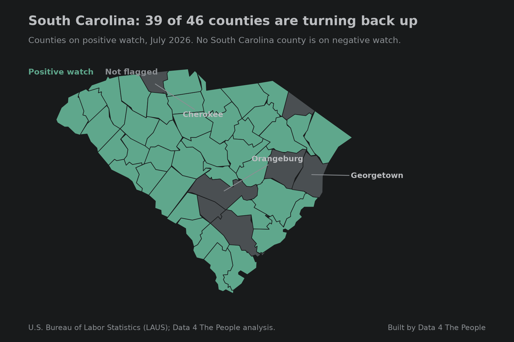
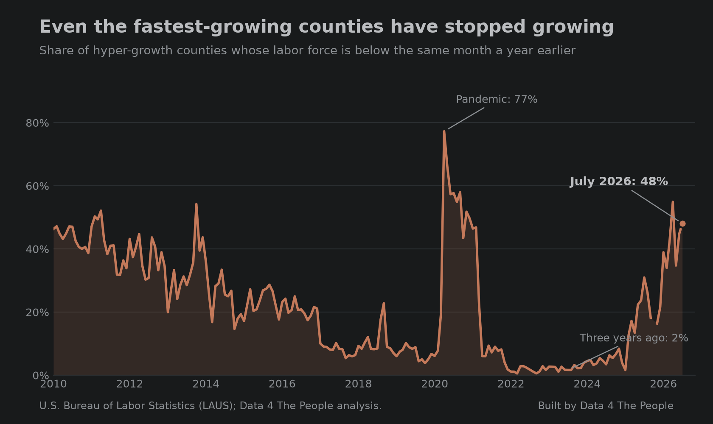
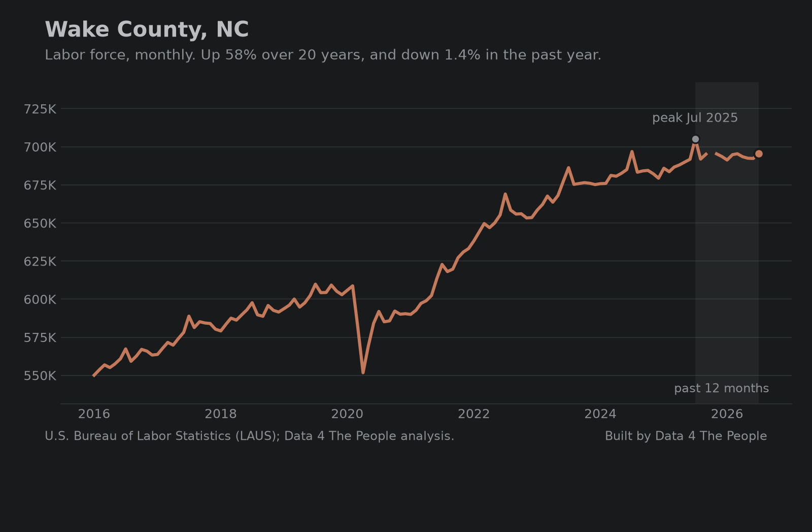
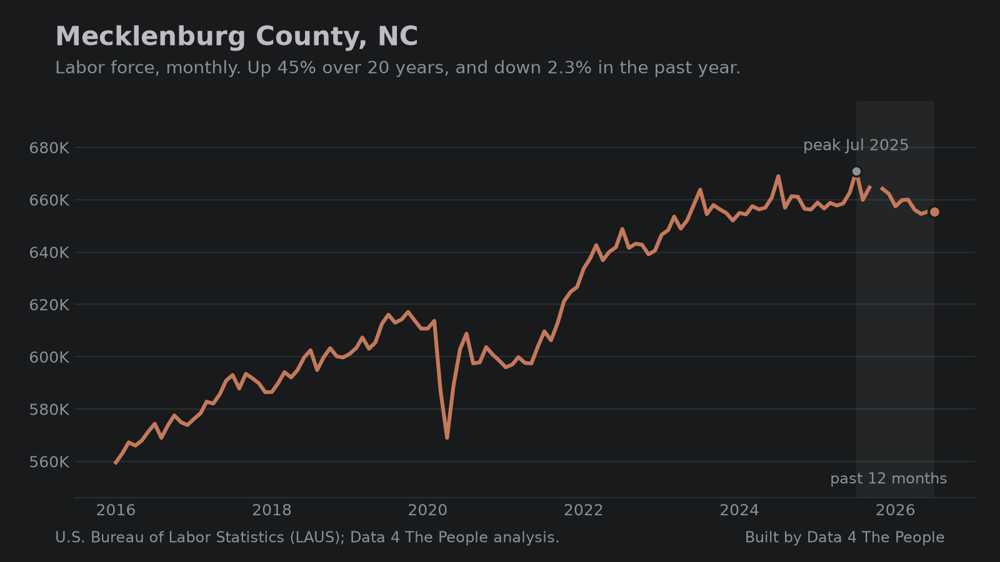
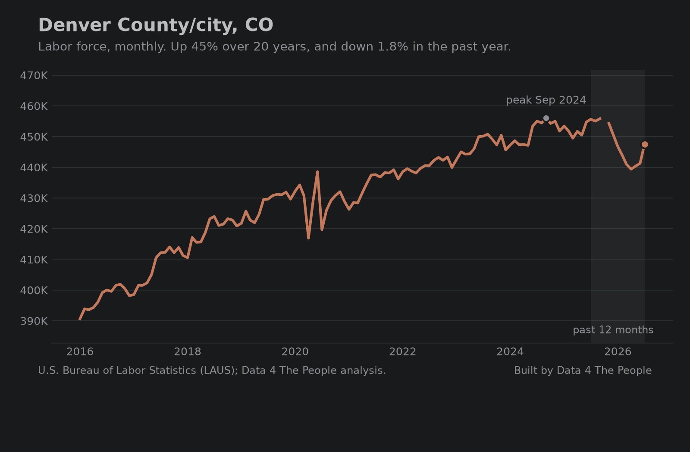
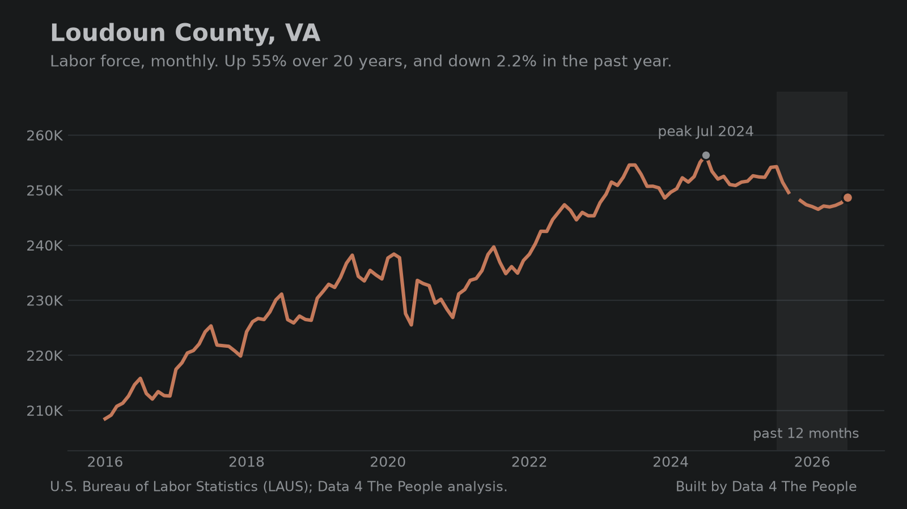
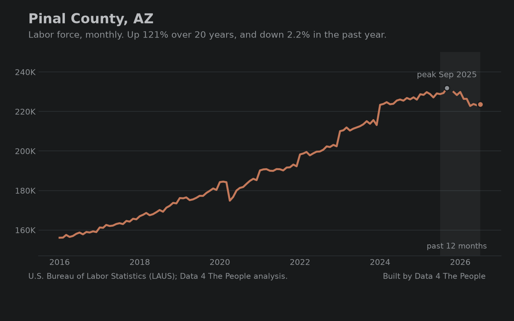
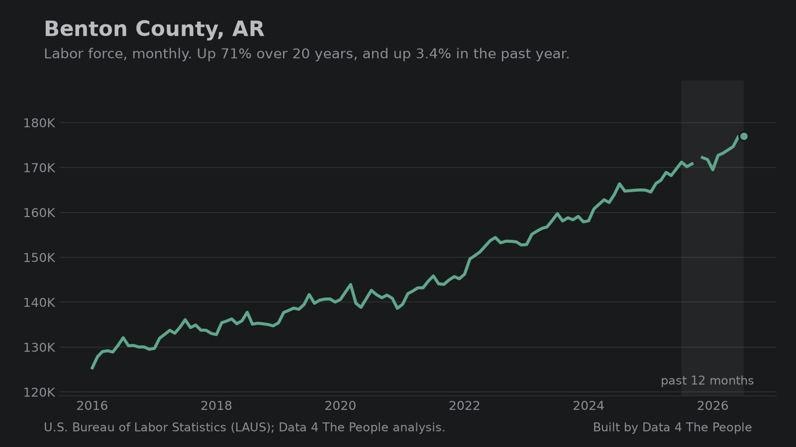
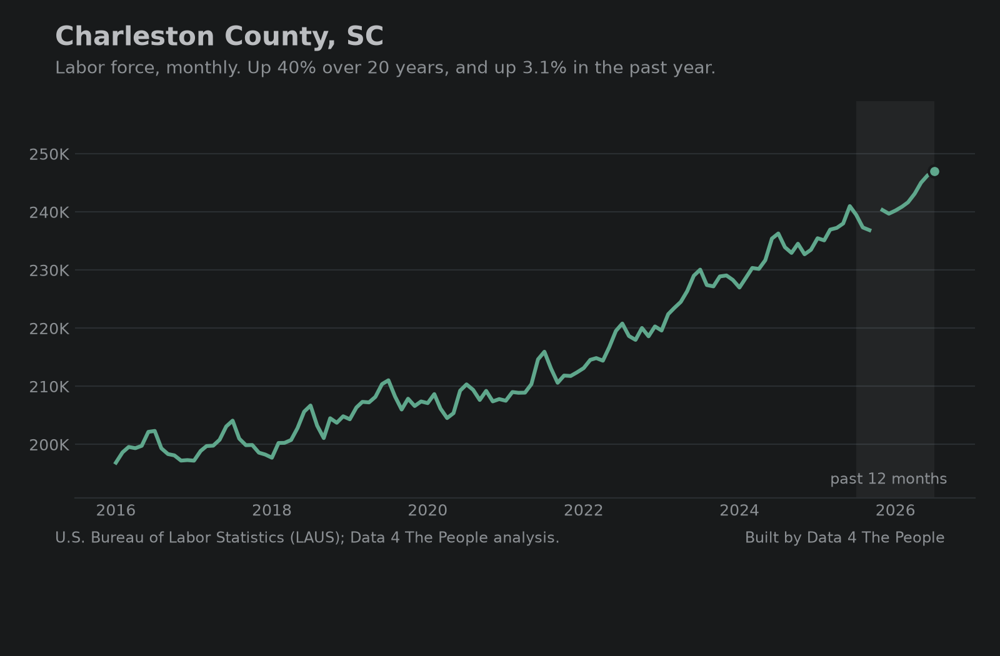
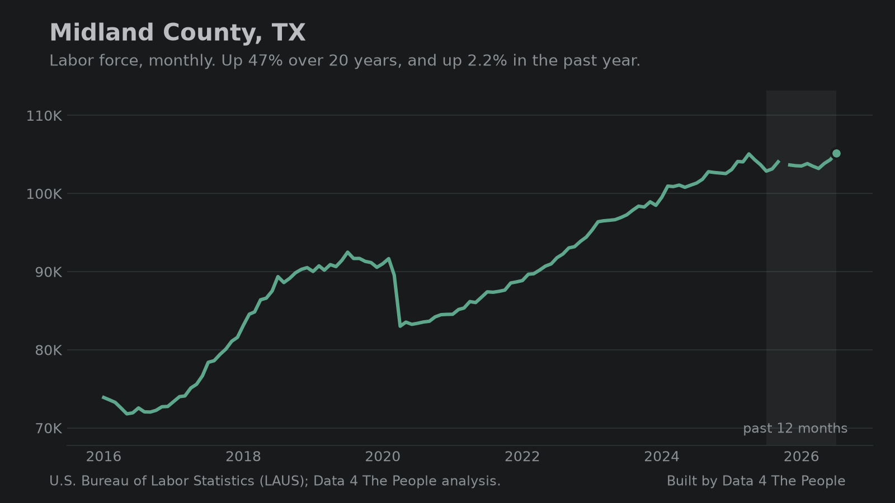

# Five takeaways from our new labor force map

We rebuilt our county labor force map this week and added data through July 2026. Five things stood out to us. We usually give you a lot of words. Today the charts do the talking.

## 1. Two in five counties are shrinking

A county is in structural loss when its labor force is more than 10% below where it stood 20 years earlier. In 2010 that was 7% of counties. It is now 40%, the highest on record. At the end of 2025, the data behind our first map, it was 33%.

*Counties whose labor force is more than 10% below the same month 20 years earlier. Source: BLS LAUS.*

## 2. This year is the weakest spring since 2020

Counties normally add workers between January and July. This year 38% of them lost workers instead, against a long-run figure of 21%. Second worst was last year.

*January and July fall in the same year, so this comparison is not affected by the January change in population estimates. Source: BLS LAUS.*

## 3. Some states are sliding almost everywhere

Our map puts a county on negative watch when its labor force is below both a year ago and three years ago. In five states, most counties carry that flag.

*Negative watch: labor force below both a year ago and three years ago. Source: BLS LAUS.*

Michigan is the clearest case. Its three largest labor markets are holding. Almost everything else is not.

*The counties shaded coral hold 54% of Michigan's workers. Source: BLS LAUS.*

Colorado is fourth on the list, and it is the opposite story from Michigan. In Michigan the big metro counties are holding while the rest of the state is on negative watch. In Colorado the decline starts with the big counties: every one of the ten largest is shrinking, Denver included, and the flags have not caught up yet.

*Only Boulder is on negative watch, which also asks for a three-year decline. Source: BLS LAUS.*

## 4. It's not all doom and gloom...

Some states have labor forces with positive momentum. The following chart shows the top five states by percent of counties on positive watch.

*Positive watch: labor force climbing off a multi-year low and above where it was three years ago. South Carolina is the strongest of the five. Source: BLS LAUS.*

Look at the South Carolina map. We looked for a reason and found migration, not a factory boom. Its counties gained people from other states, and its participation rate rose while the national rate fell. If you know the local story, we want to hear it.

*The counties shaded teal hold 95% of South Carolina's workers. Source: BLS LAUS.*

## 5. Even the boom counties have stopped

Hyper-growth counties are those whose labor force is more than 40% above its level 20 years ago. Our original key takeaway back in March was that U.S. counties had bifurcated into the haves and have-nots when it came to their labor forces. In 2026 the have counties are stalling, and some are shrinking. Two years ago, 3% of them were shrinking. Today 48% are.

*Hyper-growth means a labor force more than 40% above its level 20 years earlier. Source: BLS LAUS.*

Some of the best known growth counties in the country peaked in the past two years and have been falling since. A few are still climbing. Flip through the image carousel and see.

::: carousel-full

*Wake County, North Carolina. Up 58% over 20 years, down 1.4% in the past year.*

*Mecklenburg County, North Carolina. Up 45% over 20 years, down 2.3% in the past year.*

*Denver County, Colorado. Up 45% over 20 years, down 1.8% in the past year.*

*Loudoun County, Virginia. Up 55% over 20 years, down 2.2% in the past year.*

*Pinal County, Arizona. Up 121% over 20 years, down 2.2% in the past year.*

*Benton County, Arkansas. Up 71% over 20 years, and still growing at 3.4% a year.*

*Charleston County, South Carolina. Up 40% over 20 years, and still growing at 3.1% a year.*

*Midland County, Texas. Up 47% over 20 years, and still growing at 2.2% a year.*
:::

## Look up your own county

The map is free. Press play to watch the last 16 years, pick your state, and hover any county to see its trend.

<iframe src="https://data4thepeople.github.io/laus/" width="100%" height="780" style="border:0" title="Twenty-year change in labor force by county"></iframe>

::: spacer 40px

## What are you finding?

Let us know! Or better yet, bring the discussion to social media and share your thoughts. Tagging our work and sharing the data is much appreciated.

::: blurb What this does and does not tell you
The labor force counts people who are working or looking for work, where they live. It falls when people retire, stop looking, or move away, so a shrinking labor force is not the same as rising unemployment.

Every figure comes from the U.S. Bureau of Labor Statistics program called Local Area Unemployment Statistics. The 2026 months are estimates and will be revised next spring. In January 2026 the household survey adopted new population estimates that were not applied to earlier months, which takes about 0.2 percentage points off any comparison that crosses that month. The January to July figures in the second chart avoid it entirely.

The full method is on [the visualization page](https://www.data4thepeople.com/p/labor-force-history-viz), and the code is public at [github.com/Data4ThePeople/laus](https://github.com/Data4ThePeople/laus).
:::

## Common questions

### What is the labor force?

It is the number of people age 16 and over who are working or actively looking for work, counted where they live. It leaves out people who have retired or stopped looking.

### Why compare each county to 20 years ago?

A one-year change in a small county is mostly noise. Twenty years covers a full generation of workers entering and leaving, so it shows the structure of a local economy rather than one good or bad year.

### What does structural loss mean?

A labor force more than 10% below the same month 20 years earlier. The name is ours, not the government's.
