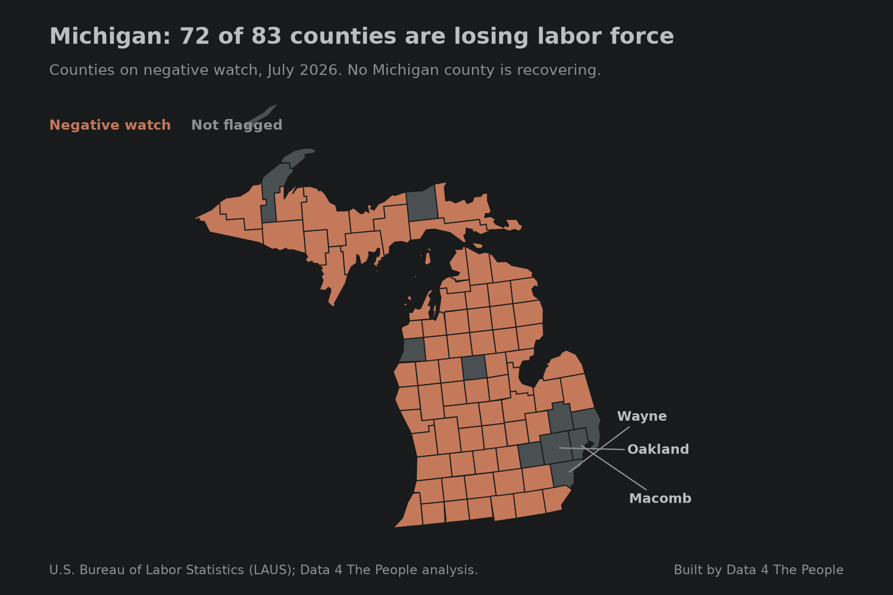

---
title:
subtitle:
slug: five-takeaways-labor-force-decline
prismic_label: "Data 4 Thought: Five Takeaways, Labor Force"
prismic_id:
date: 2026-09-17
section: Data 4 Thought
hero: images/five-takeaways-labor-force-decline-hero-1680x1080.png
hero_alt:
meta_title:
description:
keywords:
schema_type: article
drop_cap: true
heading_spacer: 20px
caption_spacer: 20px
dividers: false
---

# Title goes here

<!-- Eric's draft goes here. The five takeaways below are placed with their charts
     and captions; the prose around them is still to be written. -->

## 1. Two in five counties are now in structural loss

*Counties whose labor force is more than 10% below the same month 20 years earlier. Source: BLS LAUS.*

## 2. The weakest spring on record, outside the pandemic

*January and July sit inside the same year, so this comparison is unaffected by the January population-control change. Source: BLS LAUS.*

## 3. Whole states are sliding at once

*A negative watch means a county's labor force is below both a year ago and three years ago. Source: BLS LAUS.*

*Michigan's three largest labor markets are holding while almost everything outside them falls. Source: BLS LAUS.*

## 4. And a few states are turning back up

*A positive watch means a county's labor force has climbed off a multi-year low and is above where it was three years ago. Source: BLS LAUS.*

*Counties holding 95% of South Carolina's workers are turning up. Source: BLS LAUS.*

## 5. Even the hyper-growth counties have stalled

*Hyper-growth means a labor force more than 40% above its level 20 years earlier. Source: BLS LAUS.*

::: carousel

*Wake County, North Carolina. Up 58% over 20 years, down 1.4% in the past year.*

*Mecklenburg County, North Carolina. Up 45% over 20 years, down 2.3% in the past year.*

*Denver County, Colorado. Up 45% over 20 years, down 1.8% in the past year.*

*Loudoun County, Virginia. Up 55% over 20 years, down 2.2% in the past year.*

*Pinal County, Arizona. Up 121% over 20 years, down 2.2% in the past year.*

*Benton County, Arkansas. Up 71% over 20 years, and still growing at 3.4% a year.*

*Charleston County, South Carolina. Up 40% over 20 years, and still growing at 3.1% a year.*

*Midland County, Texas. Up 47% over 20 years, and still growing at 2.2% a year.*
:::

<iframe src="https://data4thepeople.github.io/laus/" width="100%" height="780" style="border:0" title="Twenty-year change in labor force by county"></iframe>

::: spacer 40px

## Common questions

### Where does this data come from?

Every figure comes from the U.S. Bureau of Labor Statistics program called Local Area Unemployment Statistics, which publishes a monthly labor force estimate for every county. The method behind the map is documented on [the visualization page](https://www.data4thepeople.com/p/labor-force-history-viz).
